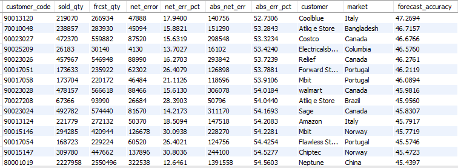

# Business Insights & Supply Chain Analytics Using SQL



## Project Overview

This project analyzes sales performance, customer contribution, market share, product demand, and forecast accuracy using SQL. The objective is to generate actionable business insights that support sales planning, market expansion, and supply chain decision-making.

## Skills Demonstrated

- SQL
- MySQL
- CTEs
- Window Functions
- Aggregate Functions
- Joins
- Dense Rank
- Forecast Accuracy Analysis
- Sales Analytics
- Supply Chain Analytics

## Business Questions & Key Insights

### 1. Top 10 Customers by Net Sales

**Objective:** Identify the highest revenue-generating customers in FY2021.

**Key Insights:**
- Amazon generated the highest net sales (109.03M), contributing 13.23% of total sales among the top customers.
- The top 10 customers account for a significant portion of revenue, highlighting the importance of key account management.
- Atliq Exclusive and Atliq e Store are among the strongest revenue contributors.

### 2. Region-wise Market Share Analysis

**Objective:** Analyze customer contribution within each region.

**Key Insights:**
- Amazon leads the APAC region with nearly 13% market share.
- Revenue is concentrated among a few major customers, indicating potential customer dependency risk.
- Regional market share analysis helps identify dominant customers and growth opportunities.

### 3. Top 2 Markets in Every Region by Gross Sales

**Objective:** Identify the strongest-performing markets across regions.

**Key Insights:**
- The top two markets in each region generate a large share of regional revenue.
- These markets should be prioritized for marketing investments and expansion strategies.
- Regional performance differences reveal potential growth opportunities in underperforming markets.

### 4. Top 3 Products by Division

**Objective:** Determine the best-selling products in each division.

**Key Insights:**
- Top-ranked products contribute the highest sales volumes within their divisions.
- These products should be prioritized for inventory planning and demand forecasting.
- Understanding product leaders helps optimize production and promotional strategies.

### 5. Forecast Accuracy Analysis

**Objective:** Measure forecasting performance for each customer.

**Key Insights:**
- Customers with high forecast accuracy demonstrate effective demand planning.
- Low forecast accuracy may lead to stockouts or excess inventory.
- Forecast accuracy is a critical KPI for improving supply chain efficiency.

### 6. Forecast Accuracy Comparison (2020 vs 2021)

**Objective:** Compare forecasting performance across years.

**Key Insights:**
- The analysis highlights customers whose forecasting performance improved or declined.
- Improved forecast accuracy indicates better planning and collaboration.
- Year-over-year comparison helps identify long-term planning trends.

  
## Project Structure

```text
business-insights-sql-project
│
├── SQL_Queries
├── Outputs
└── README.md
```

## Connect With Me

LinkedIn: www.linkedin.com/in/mohitchauhan157

GitHub: [https://github.com/mohit15799](https://github.com/mohit15799/data-analyst-portfolio)

Mohit Chauhan
